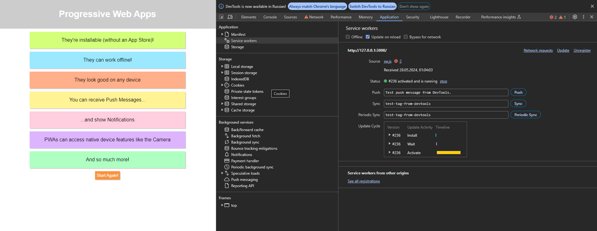

# Лабораторна робота №3

# Тема: Концепт Service Workers під час роботи з PWA

## Задача №1 - Перед початком роботи необхідно встановити Node.js

Після встановлення Node.js потрібно перевірити працює технологія це ні. Це можно зробити написавши команду:
``` cmd
    node -v
```

Та команду:

``` cmd
    npm -v
```

Ці команди вивидять версии Node.js та Node Package Manager відповідно. Результат роботи цих команд представлено на рисунку 3.1 (в залежності від версії результат може бути різним, головне щоб небуло помилки).


<br/>
рисунк 3.1 - результат роботи команд

## Задача №2 - Створіть на комп'ютері каталог (наприклад, папка LR)

На рисунку 3.2 представелно створений католог "LR3_CROSS_PLATF_PROG"


<br/>
рисунк 3.2 - створений новий каталогу

## Задача №3 - Розархівуйте в цю папку архів під назвою firs-pwa.rar

На рисунку 3.3 представлено файли з архіву firs-pwa.rar в папці "LR3_CROSS_PLATF_PROG"


<br/>
рисунок 3.3 - розархівіровані файли

## Задача №4 - Встановіть всі залежності та бібліотеки базової програми використовуючи термінал у редакторі коду VS Code

На рисунку 3.4 представлено встановлення залежностей та бібліотек базової програми, а саме встановлення бібліотеки http-server та її залежностей.

``` cmd
    npm i
```


<br/>
рисунок 3.4 - встановлення залежностей та бібліотек

## Задача №5 - Запуск програми на стороні сервера.

Щоб запустити проект у терміналі, потрібно прописати наступну команду:

``` cmd
    npm start
    # або
    npm run start
```

На рисунку 3.5 представлено запуск програми LR3_CROSS_PLATF_PROG


<br/>
рисунок 1.5 - запуск програми

На рисунку 3.6 представлено роботу стартової програми


<br/>
рисунок 3.6 - робота стартової програми

## Задача №6 - Структура програми

На рисунку 3.7 представлено структуру програми:


<br/>
рисунок 3.7 - структура програми

## Задача №7 - Робота програми з інтернетом та без

На рисунку 3.8 представлено роботу програма без інтернету


<br/>
рисунок 3.8 - робота програма без інтернету

На рисунку 3.9 представлено роботу програма з інтернетом


<br/>
рисунок 3.9 - робота програма з інтернетом

## Задача №8 - Регістрація Service Worker

На рисунку 3.10 представлено регістрацію Service Worker у програмі. Це виконуются за допомогую функції ServiceWorke.register() яку можно виклекоти за допомоною інтерфейса "navigator".

Web API navigator — це інтерфейс, наданий браузерами для отримання інформації про сам браузер і середовище користувача. Цей API дозволяє розробникам веб-застосунків отримати доступ до різних властивостей і методів, які можуть бути корисними для адаптації веб-сторінок залежно від характеристик користувача та його оточення.

Деякі з ключових можливостей та властивостей об'єкта navigator включають:

1. Navigator.userAgent: Повертає рядок, що містить інформацію про браузер, операційну систему та пристрій користувача.
2. Navigator.language та Navigator.languages: Визначають поточну мову та пріоритетні мови, встановлені у браузері користувача.
3. Navigator.onLine: Повертає значення булевого значення, що вказує, чи підключений користувач до мережі.
4. Navigator.geolocation: Надає доступ до географічного положення користувача за допомогою геолокації.
5. Navigator.cookieEnabled: Вказує, чи увімкнені cookies у браузері користувача.
6. Navigator.permissions: Дозволяє перевірити статус дозволів для різних API, таких як геолокація або сповіщення.
7. Navigator.serviceWorker: Доступ до API для роботи з сервіс-воркерами, які дозволяють створювати офлайн-досвід та інші фішки Progressive Web Apps (PWA).


<br/>
рисунок 3.10 - Регістрація Service Worker